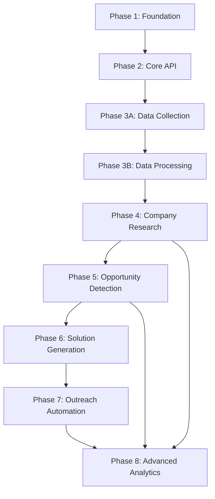

# Project Roadmap: Business Intelligence Engine (BIE)

**Last Updated**: 2025-01-30

## 1. Overall Project Vision & Goals
* Transform traditional job search automation into proactive business opportunity creation
* Build intelligent systems that identify automation opportunities in local businesses
* Create value-first approach to client acquisition through demonstration and proof-of-concept delivery
* Establish sustainable business development pipeline through data-driven intelligence

## 2. Major Project Phases / Epics

### Phase 1: Foundation & Database Setup ✅ COMPLETED
* **Description**: Core infrastructure, database schema, and development environment
* **Status**: Completed (Phase 1)
* **Key Objectives**:
  * Establish PostgreSQL database with comprehensive business intelligence schema
  * Implement FastAPI backend with auto-generated documentation
  * Create development workflow with testing, linting, and deployment automation
  * Build foundational data models for jobs, companies, and business intelligence
* **Primary HDTA Links**: 
  * [Database Infrastructure Module](../modules/module_database_infrastructure.md)
* **Notes/Key Deliverables for this Phase/Epic**:
  * Production-ready database schema with migration system
  * RESTful API with comprehensive CRUD operations
  * Automated testing framework with >90% coverage
  * Development environment with quality assurance tools

### Phase 2: Core API & Job Management ✅ COMPLETED  
* **Description**: REST API implementation and basic job data management
* **Status**: Completed (Phase 2)
* **Key Objectives**:
  * Build comprehensive API endpoints for all data entities
  * Implement advanced filtering, searching, and pagination
  * Create automated API documentation and validation
  * Establish performance monitoring and logging systems
* **Primary HDTA Links**:
  * [Database Infrastructure Module](../modules/module_database_infrastructure.md)
* **Notes/Key Deliverables for this Phase/Epic**:
  * Complete REST API with OpenAPI documentation
  * Advanced query capabilities and performance optimization
  * Input validation and error handling systems
  * API testing suite and performance monitoring

### Phase 3A: Raw Data Collection Pipeline ✅ COMPLETED
* **Description**: Web scraping infrastructure with anti-detection capabilities
* **Status**: Completed (Phase 3A)
* **Key Objectives**:
  * Implement multi-site scraping with Indeed, LinkedIn, Glassdoor
  * Build anti-detection systems using BrowserMCP and stealth techniques
  * Create robust data collection with rate limiting and error handling
  * Establish raw data storage and organization systems
* **Primary HDTA Links**:
  * [Data Collection Module](../modules/module_data_collection.md)
* **Notes/Key Deliverables for this Phase/Epic**:
  * Production-grade web scraping infrastructure
  * Anti-detection capabilities bypassing modern bot protection
  * Scalable data collection with monitoring and alerting
  * Raw data storage with comprehensive metadata tracking

### Phase 3B: Offline Processing & Data Pipeline 🚧 IN PROGRESS
* **Description**: Transform raw scraped data into structured, actionable business intelligence
* **Status**: In Progress (Phase 3B)
* **Key Objectives**:
  * Build HTML parsing and data extraction systems
  * Implement duplicate detection and data normalization
  * Create quality assurance and monitoring frameworks
  * Establish batch processing and database import automation
* **Primary HDTA Links**:
  * [Intelligence Analysis Module](../modules/module_intelligence_analysis.md)
  * [Implementation Plan: Phase 3B](../implementations/implementation_phase_3b.md)
* **Notes/Key Deliverables for this Phase/Epic**:
  * Automated data processing pipeline with quality monitoring
  * Sophisticated deduplication and normalization algorithms
  * Batch processing system for high-volume data handling
  * Quality assurance framework with comprehensive reporting

### Phase 4: Company Research & Intelligence Gathering 📋 PLANNED
* **Description**: Expand data collection to comprehensive business intelligence gathering
* **Status**: Planned
* **Key Objectives**:
  * Implement direct company website analysis and technology detection
  * Build business intelligence aggregation and company profiling
  * Create market research and competitive analysis capabilities
  * Establish contact discovery and decision maker identification
* **Primary HDTA Links**:
  * [Intelligence Analysis Module](../modules/module_intelligence_analysis.md)
  * [Data Collection Module](../modules/module_data_collection.md)
* **Notes/Key Deliverables for this Phase/Epic**:
  * Comprehensive company profiling and intelligence systems
  * Technology stack detection and analysis capabilities
  * Business research automation with market intelligence
  * Contact and decision maker identification systems

### Phase 5: Opportunity Detection & Scoring Engine 📋 PLANNED
* **Description**: Identify and score business automation opportunities
* **Status**: Planned  
* **Key Objectives**:
  * Build opportunity detection algorithms and pattern recognition
  * Implement business value scoring and ROI estimation
  * Create market opportunity prioritization and ranking systems
  * Establish competitive analysis and positioning intelligence
* **Primary HDTA Links**:
  * [Opportunity Detection Module](../modules/module_opportunity_detection.md)
* **Notes/Key Deliverables for this Phase/Epic**:
  * Automated opportunity identification and scoring
  * Business value estimation and ROI calculation
  * Market intelligence and competitive positioning
  * Target prioritization and qualification systems

### Phase 6: Solution Generation & Demo Creation 📋 PLANNED
* **Description**: Generate proof-of-concept solutions and demonstrations
* **Status**: Planned
* **Key Objectives**:
  * Build automated proof-of-concept generation systems
  * Create business case development and value proposition tools
  * Implement solution templating and customization frameworks
  * Establish demonstration and presentation automation
* **Primary HDTA Links**:
  * [Solution Generation Module](../modules/module_solution_generation.md)
* **Notes/Key Deliverables for this Phase/Epic**:
  * Automated proof-of-concept and demo generation
  * Business case development and ROI demonstration
  * Solution templating and customization systems
  * Presentation and demonstration automation tools

### Phase 7: Outreach Automation & Response Tracking 📋 PLANNED
* **Description**: Automate personalized outreach campaigns with solution delivery
* **Status**: Planned
* **Key Objectives**:
  * Build multi-channel outreach automation systems
  * Implement personalized messaging and content generation
  * Create response tracking and lead qualification automation
  * Establish campaign optimization and A/B testing frameworks
* **Primary HDTA Links**:
  * [Outreach Automation Module](../modules/module_outreach_automation.md)
* **Notes/Key Deliverables for this Phase/Epic**:
  * Automated outreach campaign management
  * Personalized messaging and content generation
  * Response tracking and lead qualification systems
  * Campaign optimization and performance analytics

### Phase 8: Advanced Analytics & Performance Optimization 📋 PLANNED
* **Description**: Advanced business intelligence, predictive analytics, and system optimization
* **Status**: Planned
* **Key Objectives**:
  * Implement machine learning for predictive opportunity identification
  * Build advanced analytics and business intelligence dashboards
  * Create performance optimization and scalability enhancements
  * Establish enterprise-grade monitoring and reporting systems
* **Primary HDTA Links**:
  * [Dashboard Interface Module](../modules/module_dashboard_interface.md)
  * All modules for optimization and enhancement
* **Notes/Key Deliverables for this Phase/Epic**:
  * Predictive analytics and machine learning capabilities
  * Advanced business intelligence and reporting systems
  * Enterprise-scale performance and optimization
  * Comprehensive monitoring and alerting infrastructure

## 3. High-Level Inter-Phase/Epic Dependencies

## 4. Key Project-Wide Milestones
* **Data Pipeline Completion**: Phase 3B data processing pipeline operational - Status: In Progress
* **Business Intelligence Foundation**: Phase 4 company research and intelligence gathering - Status: Planned
* **Opportunity Engine Launch**: Phase 5 automated opportunity detection and scoring - Status: Planned  
* **Solution Automation**: Phase 6 proof-of-concept generation and demonstration - Status: Planned
* **Full Automation Pipeline**: Phase 7 end-to-end business development automation - Status: Planned
* **Enterprise Platform**: Phase 8 advanced analytics and optimization complete - Status: Planned

## 5. Overall Project Notes / Strategic Considerations
* **Strategic Pivot**: Successfully transformed from traditional job search to business opportunity creation
* **Technology Foundation**: Built on proven, scalable technologies (FastAPI, PostgreSQL, React)
* **Data-Driven Approach**: All business development activities guided by comprehensive intelligence
* **Value-First Strategy**: Lead with working solutions rather than sales presentations
* **Automation-Centric**: Minimize manual effort through intelligent automation at every stage
* **Scalable Architecture**: Designed to handle enterprise-scale data volumes and processing requirements