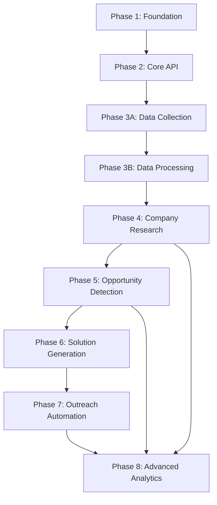

# Implementation Context

## Current Phase Status


## Active Implementations


## implementation_phase_3b.md
# Implementation Plan: Phase 3B - Offline Processing Pipeline

## Implementation Identity
**Name**: Phase 3B - Offline Processing Pipeline  
**Priority**: High  
**Status**: 🚧 Ready to Begin  
**Target Completion**: 2 weeks  
**Dependencies**: Phase 3A Raw Data Collection ✅ Complete  

## Overview
Transform raw scraped data into clean, structured, database-ready format without burning Claude Code tokens. Build robust data processing pipeline for thousands of job records.

## Problem Statement
Phase 3A successfully collects raw job data but produces unstructured HTML/JSON files. Need efficient offline processing to:
- Extract clean job data from raw HTML
- Deduplicate job postings across sources
- Normalize salary, location, and other fields
- Validate data quality before database import
- Handle processing errors gracefully

## Implementation Approach

### Week 1: Core Processing Infrastructure

#### Day 1-2: HTML Parser and Data Extractor
```python
# New module: app/processing/html_parser.py
class JobDataExtractor:
    def extract_from_indeed_html(self, raw_html):
        """Extract structured data from Indeed job HTML"""
        
    def extract_from_json_dump(self, raw_json):
        """Process JSON data from scrapers"""
        
    def normalize_job_fields(self, raw_job_data):
        """Standardize field formats and values"""
        
    def validate_required_fields(self, job_data):
        """Ensure minimum data quality standards"""
```

**Technical Details:**
- **BeautifulSoup** for robust HTML parsing
- **Regex patterns** for salary/location extraction
- **Field mapping** from raw data to database schema
- **Error logging** for parsing failures

**Input:** `scraped_data/raw/indeed_jobs_*.json`  
**Output:** `scraped_data/processed/cleaned_jobs_*.json`

#### Day 3-4: Duplicate Detection System
```python
# New module: app/processing/deduplication.py
class DuplicateDetector:
    def generate_job_hash(self, job_data):
        """Create unique hash: company + title + location"""
        
    def detect_url_duplicates(self, job_list):
        """Find exact URL matches"""
        
    def detect_content_duplicates(self, job_list):
        """Find similar content with fuzzy matching"""
        
    def merge_duplicate_records(self, duplicate_group):
        """Combine information from duplicate jobs"""
```

**Deduplication Strategy:**
1. **Exact URL Match**: Highest priority, perfect duplicates
2. **Hash Match**: Company + normalized title + location
3. **Fuzzy Matching**: Similar titles with edit distance < 3
4. **Date Preference**: Keep most recent posting

#### Day 5-7: Data Normalization Pipeline
```python
# New module: app/processing/normalizer.py
class DataNormalizer:
    def normalize_salary_ranges(self, salary_text):
        """Parse salary strings into min/max integers"""
        
    def standardize_locations(self, location_text):
        """Normalize city, state, remote options"""
        
    def extract_job_types(self, description_text):
        """Identify full-time, part-time, contract, etc."""
        
    def categorize_experience_levels(self, requirements_text):
        """Extract entry, mid, senior level requirements"""
```

**Normalization Rules:**
- **Salary**: Extract numeric ranges, handle "$50K - $75K" → (50000, 75000)
- **Location**: "San Francisco, CA" → city="San Francisco", state="CA"
- **Remote**: Detect "remote", "work from home", "WFH" keywords
- **Experience**: "2-5 years" → experience_level="mid"

### Week 2: Processing Pipeline and Database Integration

#### Day 8-10: Batch Processing System
```python
# New module: app/processing/batch_processor.py
class BatchProcessor:
    def process_daily_batch(self, date_str):
        """Process all files for a specific date"""
        
    def process_file_queue(self, file_list):
        """Process multiple files in sequence"""
        
    def generate_processing_report(self, batch_results):
        """Create summary of processing results"""
        
    def handle_processing_errors(self, error_list):
        """Log and categorize processing failures"""
```

**Processing Workflow:**
1. **File Discovery**: Scan `scraped_data/raw/` for unprocessed files
2. **Data Extraction**: Parse HTML/JSON to structured data
3. **Deduplication**: Remove duplicate jobs within batch
4. **Normalization**: Standardize all field formats
5. **Validation**: Check data quality requirements
6. **Export**: Save cleaned data to `scraped_data/processed/`

#### Day 11-12: Database Import System
```python
# New module: app/processing/db_importer.py
class DatabaseImporter:
    def bulk_import_jobs(self, processed_job_file):
        """Import cleaned jobs to database efficiently"""
        
    def update_existing_jobs(self, job_updates):
        """Update job records with new information"""
        
    def handle_import_conflicts(self, conflict_list):
        """Resolve database constraint violations"""
        
    def generate_import_statistics(self, import_results):
        """Report import success/failure metrics"""
```

**Import Strategy:**
- **Bulk INSERT**: Use SQLAlchemy bulk operations for performance
- **Conflict Resolution**: Handle unique constraint violations gracefully
- **Progress Tracking**: Log import progress for large batches
- **Rollback Support**: Transaction management for failed imports

#### Day 13-14: Quality Assurance and Monitoring
```python
# New module: app/processing/quality_monitor.py
class QualityMonitor:
    def validate_data_completeness(self, processed_data):
        """Check percentage of required fields populated"""
        
    def detect_data_anomalies(self, job_batch):
        """Identify unusual patterns or outliers"""
        
    def generate_quality_report(self, processing_session):
        """Create detailed quality metrics"""
        
    def recommend_improvements(self, quality_issues):
        """Suggest processing pipeline improvements"""
```

## File Structure Changes

### New Processing Modules
```
app/
├── processing/                   # New processing package
│   ├── __init__.py
│   ├── html_parser.py           # HTML/JSON data extraction
│   ├── deduplication.py         # Duplicate detection and merging
│   ├── normalizer.py            # Data field normalization
│   ├── batch_processor.py       # Batch processing orchestration
│   ├── db_importer.py           # Database import utilities
│   └── quality_monitor.py       # Data quality validation
└── cli/                         # New CLI package
    ├── __init__.py
    └── process_data.py           # Command-line processing interface
```

### Enhanced Data Storage
```
scraped_data/
├── raw/                         # Unprocessed scraper output
│   ├── indeed_jobs_20250524.json
│   └── grassvalley_enhanced_20250524.json
├── processed/                   # Cleaned, normalized data
│   ├── cleaned_jobs_20250524.json
│   └── processing_report_20250524.json
├── imported/                    # Successfully imported to database
│   └── import_log_20250524.json
└── errors/                      # Processing failures for review
    ├── parsing_errors_20250524.json
    └── validation_failures_20250524.json
```

## CLI Interface
```bash
# Process specific date
python -m app.cli.process_data --date 2025-05-24

# Process all pending files
python -m app.cli.process_data --process-all

# Import to database
python -m app.cli.process_data --import --file processed/cleaned_jobs_20250524.json

# Generate quality report
python -m app.cli.process_data --quality-report --date 2025-05-24
```

## Data Quality Standards

### Required Fields (Must be present)
- **title**: Job title (non-empty string)
- **company**: Company name (non-empty string)
- **location**: Location information (city/state or "Remote")

### Validated Fields (Quality checked)
- **salary_min/max**: Numeric values, min <= max
- **posting_date**: Valid date format, not future
- **job_url**: Valid URL format, unique in batch
- **description**: Minimum 50 characters
- **requirements**: Minimum 20 characters

### Quality Metrics
- **Completeness**: % of jobs with all required fields
- **Accuracy**: % of validated fields passing checks
- **Uniqueness**: % of jobs without duplicates
- **Freshness**: Average age of job postings

## Performance Targets

### Processing Speed
- **Parsing Rate**: 100+ jobs per minute
- **Deduplication**: Handle 10,000+ jobs in memory
- **Normalization**: Process full batch in < 5 minutes
- **Database Import**: 1,000+ jobs per minute bulk insert

### Data Quality Goals
- **Required Field Completeness**: > 95%
- **Salary Parsing Success**: > 80%
- **Location Normalization**: > 90%
- **Duplicate Detection**: > 99% accuracy

## Error Handling Strategy

### Parsing Errors
- **Log Details**: Raw HTML snippet, error message, job URL
- **Graceful Degradation**: Save partial data when possible
- **Manual Review Queue**: Flag complex cases for human review

### Validation Failures
- **Field-Level Validation**: Check each field independently
- **Soft Failures**: Allow import with warnings for minor issues
- **Hard Failures**: Reject jobs missing critical data

### Database Errors
- **Constraint Violations**: Handle unique constraint conflicts
- **Connection Issues**: Retry with exponential backoff
- **Transaction Rollback**: Maintain data consistency

## Testing Strategy

### Unit Tests
```python
def test_salary_parsing():
    """Test various salary format parsing"""
    
def test_duplicate_detection():
    """Validate duplicate identification accuracy"""
    
def test_data_normalization():
    """Check field standardization results"""
```

### Integration Tests
```python
def test_end_to_end_processing():
    """Test complete raw → processed → imported workflow"""
    
def test_batch_processing_performance():
    """Validate processing speed with large datasets"""
```

### Quality Assurance
- **Sample Data Validation**: Manual review of processed results
- **Performance Benchmarking**: Processing speed measurement
- **Data Accuracy Verification**: Spot-check against original sources

## Success Criteria

### Technical Milestones
- [ ] Process 1,000+ jobs without errors
- [ ] Achieve < 5% duplicate rate in processed data
- [ ] Import 10,000+ jobs to database successfully
- [ ] Maintain processing speed > 50 jobs/minute

### Quality Milestones
- [ ] 95%+ required field completeness
- [ ] 85%+ salary parsing success rate
- [ ] 90%+ location normalization accuracy
- [ ] < 2% false positive duplicate detection

### Operational Milestones
- [ ] Automated daily processing pipeline
- [ ] Quality monitoring dashboard
- [ ] Error handling and recovery procedures
- [ ] Documentation for maintenance and scaling

---

*This implementation completes the token-efficient scraping strategy by providing robust offline data processing without burning Claude Code tokens on content analysis.*

## implementation_strategic_pivot.md
# Implementation Plan: Strategic Pivot to Market Creation

## Implementation Identity
**Name**: Strategic Pivot - JobBot to BusinessBot  
**Priority**: High  
**Status**: 🚧 Phase 3B Architecture Design  
**Target Completion**: Phase 4 (4-6 weeks)  
**Dependencies**: Phase 3A Raw Data Collection (Complete)  

## Strategic Context

### From Job Hunting to Market Creation
**Original Approach**: Apply to existing job postings (reactive)  
**New Approach**: Create markets and opportunities (proactive)  
**Identity Shift**: Job seeker → AI automation expert and value creator  

### Value Proposition Evolution
- **Before**: "I can do the job you posted"
- **After**: "I can solve problems you didn't know you had"
- **Method**: Research, identify opportunities, deliver proof-of-concepts, build relationships

## Implementation Phases

### Phase 3B: Business Intelligence Infrastructure (4 weeks)

#### Week 1: Company Research Module
```python
# New module: app/research/company_intel.py
class CompanyResearcher:
    def research_local_companies(self, location_radius=50):
        """Identify local companies for business development"""
        
    def analyze_company_website(self, company_url):
        """Extract technology stack and pain points"""
        
    def identify_decision_makers(self, company_data):
        """Find key contacts for outreach"""
        
    def assess_automation_potential(self, company_profile):
        """Score automation opportunities (1-10)"""
```

**Deliverables:**
- [ ] Company data model and database schema
- [ ] Web scraping for local business directories
- [ ] Website analysis for technology detection
- [ ] LinkedIn/company page data extraction
- [ ] Initial database of 100+ local companies

#### Week 2: Opportunity Detection Engine
```python
# New module: app/intelligence/opportunity_detector.py
class OpportunityDetector:
    def analyze_business_processes(self, company_data):
        """Identify automation opportunities"""
        
    def generate_value_propositions(self, opportunities):
        """Create specific solution approaches"""
        
    def estimate_roi(self, solution_approach):
        """Calculate potential value/savings"""
        
    def prioritize_opportunities(self, opportunity_list):
        """Rank by impact and implementation ease"""
```

**Deliverables:**
- [ ] Opportunity scoring algorithm
- [ ] Value estimation models
- [ ] Solution template library
- [ ] Priority ranking system
- [ ] 50+ identified opportunities in database

#### Week 3: Proof-of-Concept Generator
```python
# New module: app/solutions/poc_generator.py
class ProofOfConceptGenerator:
    def create_automation_demo(self, opportunity):
        """Build working proof-of-concept"""
        
    def generate_roi_presentation(self, demo_results):
        """Create business case presentation"""
        
    def create_implementation_plan(self, approved_poc):
        """Detailed project plan and timeline"""
```

**Deliverables:**
- [ ] POC template system
- [ ] Demo automation scripts
- [ ] ROI calculation tools
- [ ] Presentation generation
- [ ] 10+ working proof-of-concepts

#### Week 4: Outreach Automation System
```python
# New module: app/outreach/campaign_manager.py
class OutreachManager:
    def craft_personalized_messages(self, company, opportunity):
        """Generate customized outreach content"""
        
    def schedule_multi_touch_campaigns(self, contact_list):
        """Automated follow-up sequences"""
        
    def track_engagement_metrics(self, campaign_id):
        """Monitor response rates and optimization"""
```

**Deliverables:**
- [ ] Email automation system
- [ ] LinkedIn outreach integration
- [ ] Response tracking and analysis
- [ ] Campaign performance metrics
- [ ] 100+ initial outreach contacts

### Phase 4: Advanced Business Development (4 weeks)

#### Week 5-6: AI-Powered Market Analysis
- [ ] Industry trend analysis
- [ ] Competitive landscape mapping
- [ ] Technology adoption tracking
- [ ] Market gap identification
- [ ] Predictive opportunity modeling

#### Week 7-8: Relationship Management System
- [ ] CRM integration for business contacts
- [ ] Meeting scheduling automation
- [ ] Project pipeline management
- [ ] Client communication tracking
- [ ] Success metrics and analytics

## Database Schema Extensions

### New Tables Required
```sql
-- Business intelligence
CREATE TABLE companies (
    id SERIAL PRIMARY KEY,
    name VARCHAR(255) NOT NULL,
    industry VARCHAR(100),
    size VARCHAR(50),
    location VARCHAR(255),
    website VARCHAR(500),
    automation_opportunities JSONB,
    technology_stack JSONB,
    pain_points JSONB,
    decision_makers JSONB,
    research_date TIMESTAMP DEFAULT NOW(),
    confidence_score FLOAT DEFAULT 0.0
);

-- Opportunity tracking
CREATE TABLE opportunities (
    id SERIAL PRIMARY KEY,
    company_id INTEGER REFERENCES companies(id),
    problem_description TEXT NOT NULL,
    solution_approach TEXT NOT NULL,
    estimated_value INTEGER,
    implementation_complexity VARCHAR(50),
    confidence_score FLOAT DEFAULT 0.0,
    proof_of_concept_created BOOLEAN DEFAULT FALSE,
    status VARCHAR(50) DEFAULT 'identified'
);

-- Outreach campaigns
CREATE TABLE outreach_campaigns (
    id SERIAL PRIMARY KEY,
    company_id INTEGER REFERENCES companies(id),
    opportunity_id INTEGER REFERENCES opportunities(id),
    contact_method VARCHAR(50),
    contact_person VARCHAR(255),
    message_content TEXT,
    sent_date TIMESTAMP,
    response_status VARCHAR(50) DEFAULT 'sent',
    response_date TIMESTAMP,
    follow_up_scheduled TIMESTAMP,
    notes TEXT
);

-- Proof of concepts
CREATE TABLE proof_of_concepts (
    id SERIAL PRIMARY KEY,
    opportunity_id INTEGER REFERENCES opportunities(id),
    demo_type VARCHAR(100),
    implementation_time INTEGER, -- hours
    demonstrated_value INTEGER, -- $ or % improvement
    client_feedback TEXT,
    status VARCHAR(50) DEFAULT 'created',
    created_date TIMESTAMP DEFAULT NOW()
);
```

## API Endpoints Required

### Company Research APIs
```python
@router.get("/companies")
async def list_companies(location: str = None, industry: str = None)

@router.post("/companies/research")
async def research_company(company_data: CompanyResearchRequest)

@router.get("/companies/{company_id}/opportunities")
async def get_company_opportunities(company_id: int)
```

### Opportunity Management APIs
```python
@router.post("/opportunities")
async def create_opportunity(opportunity: OpportunityRequest)

@router.get("/opportunities")
async def list_opportunities(status: str = None, priority: str = None)

@router.post("/opportunities/{opportunity_id}/poc")
async def generate_proof_of_concept(opportunity_id: int)
```

### Outreach Campaign APIs
```python
@router.post("/outreach/campaigns")
async def create_campaign(campaign: CampaignRequest)

@router.get("/outreach/campaigns/{campaign_id}/metrics")
async def get_campaign_metrics(campaign_id: int)

@router.post("/outreach/campaigns/{campaign_id}/follow-up")
async def schedule_follow_up(campaign_id: int, follow_up: FollowUpRequest)
```

## Integration Requirements

### External Service Integration
- **LinkedIn API**: Contact research and outreach
- **Google Places API**: Local business discovery
- **Email Services**: Automated outreach campaigns
- **CRM Systems**: Relationship management
- **Website Analysis**: Technology stack detection

### MCP Server Requirements
- **gmail**: Email automation and response monitoring
- **fetch**: Web scraping and API integration
- **filesystem**: Document and template management
- **postgres**: Complex business intelligence queries

## Success Metrics

### Business Development KPIs
- **Companies Researched**: 500+ local businesses in database
- **Opportunities Identified**: 200+ automation opportunities
- **Proof-of-Concepts Created**: 50+ working demonstrations
- **Outreach Success Rate**: 15%+ positive response rate
- **Business Relationships**: 25+ qualified prospects
- **Revenue Pipeline**: $100K+ in potential project value

### Technical Performance Metrics
- **Research Automation**: 10+ companies analyzed per hour
- **Data Quality**: 90%+ accurate company information
- **POC Generation Time**: <4 hours per demonstration
- **Outreach Personalization**: 100% customized messages
- **Campaign Tracking**: Real-time engagement metrics

## Risk Mitigation

### Technical Risks
- **Data Quality**: Implement validation and human review
- **Rate Limiting**: Respect API limits and website ToS
- **Detection Avoidance**: Use proper user agents and delays
- **Database Performance**: Optimize queries and indexing

### Business Risks
- **Legal Compliance**: Ensure GDPR/privacy compliance
- **Reputation Management**: Professional outreach standards
- **Spam Prevention**: Quality content and opt-out mechanisms
- **Relationship Building**: Focus on value, not volume

## Testing Strategy

### Unit Testing
```python
def test_company_research_extraction():
    """Test company data extraction accuracy"""
    
def test_opportunity_scoring_algorithm():
    """Validate opportunity prioritization logic"""
    
def test_poc_generation_quality():
    """Ensure proof-of-concepts meet standards"""
```

### Integration Testing
- [ ] End-to-end business development workflow
- [ ] External API integration validation
- [ ] Database performance under load
- [ ] Email automation deliverability

### User Acceptance Testing
- [ ] Manual review of research quality
- [ ] Outreach message effectiveness
- [ ] Proof-of-concept demonstration success
- [ ] Business relationship building outcomes

---

*This implementation plan transforms JobBot from a traditional job search tool into a comprehensive business development and market creation system.*

## Phase Roadmap


## project_roadmap.md
# Project Roadmap: Business Intelligence Engine (BIE)

**Last Updated**: 2025-01-30

## 1. Overall Project Vision & Goals
* Transform traditional job search automation into proactive business opportunity creation
* Build intelligent systems that identify automation opportunities in local businesses
* Create value-first approach to client acquisition through demonstration and proof-of-concept delivery
* Establish sustainable business development pipeline through data-driven intelligence

## 2. Major Project Phases / Epics

### Phase 1: Foundation & Database Setup ✅ COMPLETED
* **Description**: Core infrastructure, database schema, and development environment
* **Status**: Completed (Phase 1)
* **Key Objectives**:
  * Establish PostgreSQL database with comprehensive business intelligence schema
  * Implement FastAPI backend with auto-generated documentation
  * Create development workflow with testing, linting, and deployment automation
  * Build foundational data models for jobs, companies, and business intelligence
* **Primary HDTA Links**: 
  * [Database Infrastructure Module](../modules/module_database_infrastructure.md)
* **Notes/Key Deliverables for this Phase/Epic**:
  * Production-ready database schema with migration system
  * RESTful API with comprehensive CRUD operations
  * Automated testing framework with >90% coverage
  * Development environment with quality assurance tools

### Phase 2: Core API & Job Management ✅ COMPLETED  
* **Description**: REST API implementation and basic job data management
* **Status**: Completed (Phase 2)
* **Key Objectives**:
  * Build comprehensive API endpoints for all data entities
  * Implement advanced filtering, searching, and pagination
  * Create automated API documentation and validation
  * Establish performance monitoring and logging systems
* **Primary HDTA Links**:
  * [Database Infrastructure Module](../modules/module_database_infrastructure.md)
* **Notes/Key Deliverables for this Phase/Epic**:
  * Complete REST API with OpenAPI documentation
  * Advanced query capabilities and performance optimization
  * Input validation and error handling systems
  * API testing suite and performance monitoring

### Phase 3A: Raw Data Collection Pipeline ✅ COMPLETED
* **Description**: Web scraping infrastructure with anti-detection capabilities
* **Status**: Completed (Phase 3A)
* **Key Objectives**:
  * Implement multi-site scraping with Indeed, LinkedIn, Glassdoor
  * Build anti-detection systems using BrowserMCP and stealth techniques
  * Create robust data collection with rate limiting and error handling
  * Establish raw data storage and organization systems
* **Primary HDTA Links**:
  * [Data Collection Module](../modules/module_data_collection.md)
* **Notes/Key Deliverables for this Phase/Epic**:
  * Production-grade web scraping infrastructure
  * Anti-detection capabilities bypassing modern bot protection
  * Scalable data collection with monitoring and alerting
  * Raw data storage with comprehensive metadata tracking

### Phase 3B: Offline Processing & Data Pipeline 🚧 IN PROGRESS
* **Description**: Transform raw scraped data into structured, actionable business intelligence
* **Status**: In Progress (Phase 3B)
* **Key Objectives**:
  * Build HTML parsing and data extraction systems
  * Implement duplicate detection and data normalization
  * Create quality assurance and monitoring frameworks
  * Establish batch processing and database import automation
* **Primary HDTA Links**:
  * [Intelligence Analysis Module](../modules/module_intelligence_analysis.md)
  * [Implementation Plan: Phase 3B](../implementations/implementation_phase_3b.md)
* **Notes/Key Deliverables for this Phase/Epic**:
  * Automated data processing pipeline with quality monitoring
  * Sophisticated deduplication and normalization algorithms
  * Batch processing system for high-volume data handling
  * Quality assurance framework with comprehensive reporting

### Phase 4: Company Research & Intelligence Gathering 📋 PLANNED
* **Description**: Expand data collection to comprehensive business intelligence gathering
* **Status**: Planned
* **Key Objectives**:
  * Implement direct company website analysis and technology detection
  * Build business intelligence aggregation and company profiling
  * Create market research and competitive analysis capabilities
  * Establish contact discovery and decision maker identification
* **Primary HDTA Links**:
  * [Intelligence Analysis Module](../modules/module_intelligence_analysis.md)
  * [Data Collection Module](../modules/module_data_collection.md)
* **Notes/Key Deliverables for this Phase/Epic**:
  * Comprehensive company profiling and intelligence systems
  * Technology stack detection and analysis capabilities
  * Business research automation with market intelligence
  * Contact and decision maker identification systems

### Phase 5: Opportunity Detection & Scoring Engine 📋 PLANNED
* **Description**: Identify and score business automation opportunities
* **Status**: Planned  
* **Key Objectives**:
  * Build opportunity detection algorithms and pattern recognition
  * Implement business value scoring and ROI estimation
  * Create market opportunity prioritization and ranking systems
  * Establish competitive analysis and positioning intelligence
* **Primary HDTA Links**:
  * [Opportunity Detection Module](../modules/module_opportunity_detection.md)
* **Notes/Key Deliverables for this Phase/Epic**:
  * Automated opportunity identification and scoring
  * Business value estimation and ROI calculation
  * Market intelligence and competitive positioning
  * Target prioritization and qualification systems

### Phase 6: Solution Generation & Demo Creation 📋 PLANNED
* **Description**: Generate proof-of-concept solutions and demonstrations
* **Status**: Planned
* **Key Objectives**:
  * Build automated proof-of-concept generation systems
  * Create business case development and value proposition tools
  * Implement solution templating and customization frameworks
  * Establish demonstration and presentation automation
* **Primary HDTA Links**:
  * [Solution Generation Module](../modules/module_solution_generation.md)
* **Notes/Key Deliverables for this Phase/Epic**:
  * Automated proof-of-concept and demo generation
  * Business case development and ROI demonstration
  * Solution templating and customization systems
  * Presentation and demonstration automation tools

### Phase 7: Outreach Automation & Response Tracking 📋 PLANNED
* **Description**: Automate personalized outreach campaigns with solution delivery
* **Status**: Planned
* **Key Objectives**:
  * Build multi-channel outreach automation systems
  * Implement personalized messaging and content generation
  * Create response tracking and lead qualification automation
  * Establish campaign optimization and A/B testing frameworks
* **Primary HDTA Links**:
  * [Outreach Automation Module](../modules/module_outreach_automation.md)
* **Notes/Key Deliverables for this Phase/Epic**:
  * Automated outreach campaign management
  * Personalized messaging and content generation
  * Response tracking and lead qualification systems
  * Campaign optimization and performance analytics

### Phase 8: Advanced Analytics & Performance Optimization 📋 PLANNED
* **Description**: Advanced business intelligence, predictive analytics, and system optimization
* **Status**: Planned
* **Key Objectives**:
  * Implement machine learning for predictive opportunity identification
  * Build advanced analytics and business intelligence dashboards
  * Create performance optimization and scalability enhancements
  * Establish enterprise-grade monitoring and reporting systems
* **Primary HDTA Links**:
  * [Dashboard Interface Module](../modules/module_dashboard_interface.md)
  * All modules for optimization and enhancement
* **Notes/Key Deliverables for this Phase/Epic**:
  * Predictive analytics and machine learning capabilities
  * Advanced business intelligence and reporting systems
  * Enterprise-scale performance and optimization
  * Comprehensive monitoring and alerting infrastructure

## 3. High-Level Inter-Phase/Epic Dependencies


## 4. Key Project-Wide Milestones
* **Data Pipeline Completion**: Phase 3B data processing pipeline operational - Status: In Progress
* **Business Intelligence Foundation**: Phase 4 company research and intelligence gathering - Status: Planned
* **Opportunity Engine Launch**: Phase 5 automated opportunity detection and scoring - Status: Planned  
* **Solution Automation**: Phase 6 proof-of-concept generation and demonstration - Status: Planned
* **Full Automation Pipeline**: Phase 7 end-to-end business development automation - Status: Planned
* **Enterprise Platform**: Phase 8 advanced analytics and optimization complete - Status: Planned

## 5. Overall Project Notes / Strategic Considerations
* **Strategic Pivot**: Successfully transformed from traditional job search to business opportunity creation
* **Technology Foundation**: Built on proven, scalable technologies (FastAPI, PostgreSQL, React)
* **Data-Driven Approach**: All business development activities guided by comprehensive intelligence
* **Value-First Strategy**: Lead with working solutions rather than sales presentations
* **Automation-Centric**: Minimize manual effort through intelligent automation at every stage
* **Scalable Architecture**: Designed to handle enterprise-scale data volumes and processing requirements

## Current Session Context


## Next Actions

